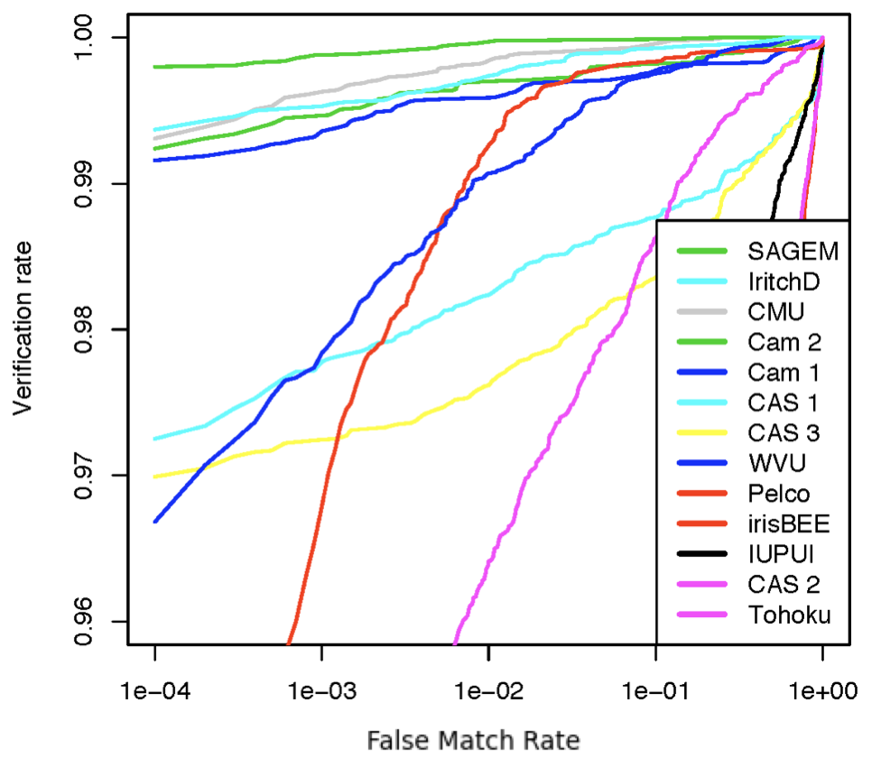
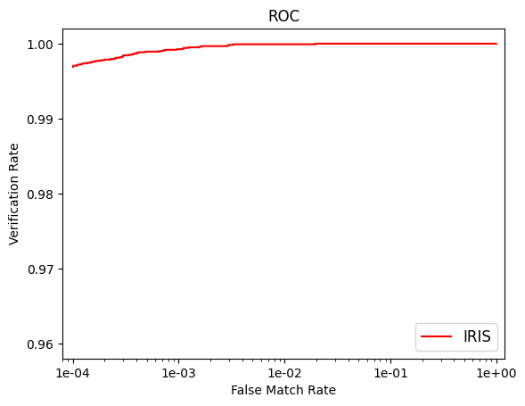
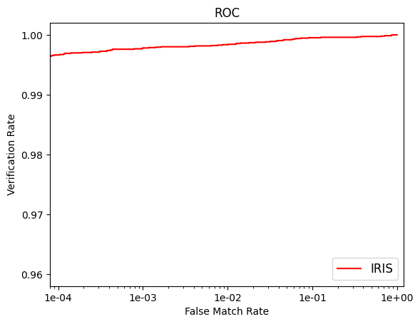
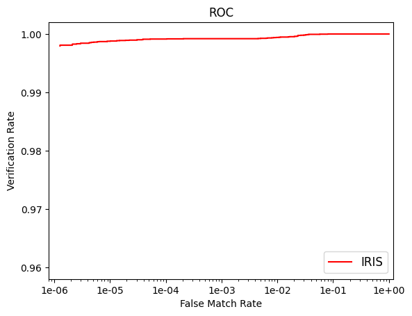
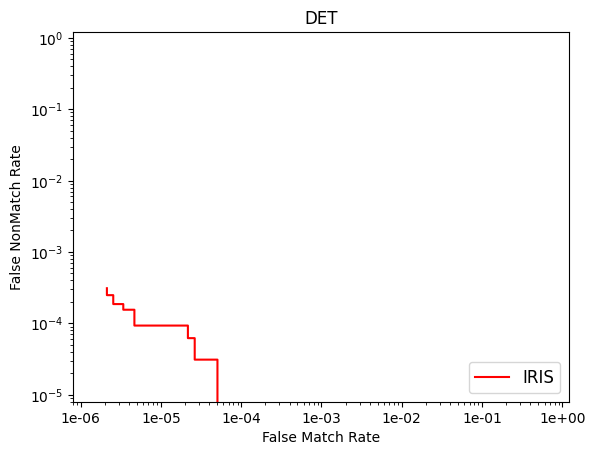

# IRIS Performance Card

## ICE 2005 dataset

ICE 2005 dataset is used by the National Institute of Standards and Technology (NIST) in Iris Challenge Evaluation (ICE) 2005 [1] and was made publicly available as part of the ND-Iris-0405 dataset from the University of Notre Dame [2]. This dataset includes 2953 images collected from 132 subjects using an LG EOU 2200 scanner at 640x480 image resolution.

## Comparison with ICE 2005 participants

A list of public and private entities participated in the ICE 2005 is shown below. The full evaluation report can be found in [1].

Fig. 1(a) and 1(b) show the ROC on right and left eye, respectively, from all participants in Iris Challenge Evaluation (ICE) 2005 and Fig. 2(a) and 2(b) show our ROC in comparison*. Although the exact error rates were not published in [1], these plots show IRIS performs as good as if not better than commercial algorithms available at the time.

| Fig. 1(a) participant ROC on ICE 2005 (right eye) [1]|  Fig. 1(b) participant ROC on ICE 2005 (left eye) [1]|
|---|---|
|  Fig. 2(a) IRIS ROC on ICE 2005 (right eye)|  Fig. 2(b) IRIS ROC on ICE 2005 (left eye)|

## Comparison with other open source algorithms

We also compare our performance with the latest available iris open source algorithm OSIRIS, which has three versions OSIRISV2, OSIRISV4, OSIRISV4.1 [3] as well as HDBIF [4]. As we can see in the table below, IRIS achieves significantly lower False NonMatch Rate (FNMR) at False Match Rate (FMR) of 0.001 and 0.0001 than these open source algorithms.

|                   | OSIRISV2  [2009] | OSIRISV4  [2011] | OSIRISV4.1  [2016] | HDBIF  [2019] | IRIS\*  [2023] |
|-------------------|----------|----------|------------|-------|--------|
| FNMR @ FMR=0.001  | 0.174    | 0.031    | 0.019      | 0.025 | 0.003  |
| FNMR @ FMR=0.0001 | 0.268    | 0.058    | 0.034      | 0.039 | 0.006  |

\*Note that four left eye images failed the default enrollment setting in IRIS with a Failure-To-Enroll (FTE) rate of 0.00135. 

## ND-LG4000 dataset

ND-LG4000 dataset is part of the ND-CrossSensor-Iris-2013 public dataset from the University of Notre Dame [5]. This dataset was collected from 676 subjects using LG IrisAccess 4000 scanner with image resolution 640x480. We randomly chose 541 subjects for training, 67 subjects for validating the segmentation model in IRIS. The remaining 2187 images from 68 subjects were used for testing, resulting in a total of ~2.4 million matches.

| Fig. 3(a) IRIS ROC on ND-LG4000|  Fig. 3(b) IRIS DET on ND-LG4000|
|---|---|

Fig. 3(a) shows the ROC for ND-LG4000 dataset, where Fig. 3(b) shows the DET in log-scale for the same dataset. Note that both plots are mathematically equivalent, where ROC shows the verification rate at a given FMR, while DET shows in log-scale the FNMR, or (1.0 - verification rate), at a given FMR.

## WLD-InHouse-v2 dataset

**_Disclaimer: This data was not collected from Worldcoin users during field operations, but stems primarily from paid participants in a dedicated workstream, separately administered by a respected partner._**

The WLD-InHouse-v2 dataset was internally collected to simulate more challenging environments in both indoor and outdoor settings using the Orb [6]. This dataset comes from a research workstream which is isolated from Worldcoin’s operations and includes more than 2k images from 98 subjects with high resolution 1440x1080, resulting in a total of ~2.6 million matches.

| Fig. 4(a) IRIS* ROC on WLD-InHouse-v2|  Fig. 4(b) IRIS* DET on WLD-InHouse-v2|
|---|---|

> **Note**: IRIS* is an optimised version of IRIS to accommodate high-resolution images captured by the Orb.

Note that in the above public dataset tests, errors are mainly caused by poor image quality due to offgaze, motion blur and occlusion. These errors are greatly reduced in our WLD-InHouse-v2 dataset due to the auto-focus capability and stringent image quality control of the Orb. Together with the effectiveness of iris encoding enabled by IRIS*, we are able to achieve high accuracy with FNMR less than 0.0001 at FMR of 0.000001 in WLD-InHouse-v2 dataset.

## References

1. Phillips, P. , Bowyer, K. , Flynn, P. , Liu, X. and Scruggs, W. (2008), The Iris Challenge Evaluation 2005, IEEE Second International Conference on Biometrics: Theory, Applications and Systems (BTAS 08), Arlington, VA, (https://tsapps.nist.gov/publication/get_pdf.cfm?pub_id=890057)
2. Bowyer, K. , Flynn, P. (2016), The ND-IRIS-0405 Iris Image Dataset, (https://arxiv.org/abs/1606.04853)
3. Othman, N. , Dorizzi, B. , Garcia-Salicetti, S. (2016), OSIRIS: An open source iris recognition software, Pattern Recognition Letters, vol.82, part2, pp.124-131, 2016. (https://github.com/tohki/iris-osiris)
4. Czajka, A. , Moreira, D. , Bowyer K. and Flynn, P. (2019), Domain-Specific Human-Inspired Binarized Statistical Image Features for Iris Recognition, IEEE Winter Conference on Applications of Computer Vision (WACV), Waikoloa, HI, USA, pp. 959-967, (https://ieeexplore.ieee.org/document/8658238, https://github.com/CVRL/OpenSourceIrisRecognition)
5. The ND-CrossSensor-Iris-2013 Dataset (Accessed 2018), (https://cvrl.nd.edu/projects/data/#nd-crosssensor-iris-2013-data-set)
6. The Worldcoin Foundation blog (2023), Opening The Orb: A look inside Worldcoin’s biometric imaging device, (https://worldcoin.org/blog/engineering/opening-orb-look-inside-worldcoin-biometric-imaging-device)
